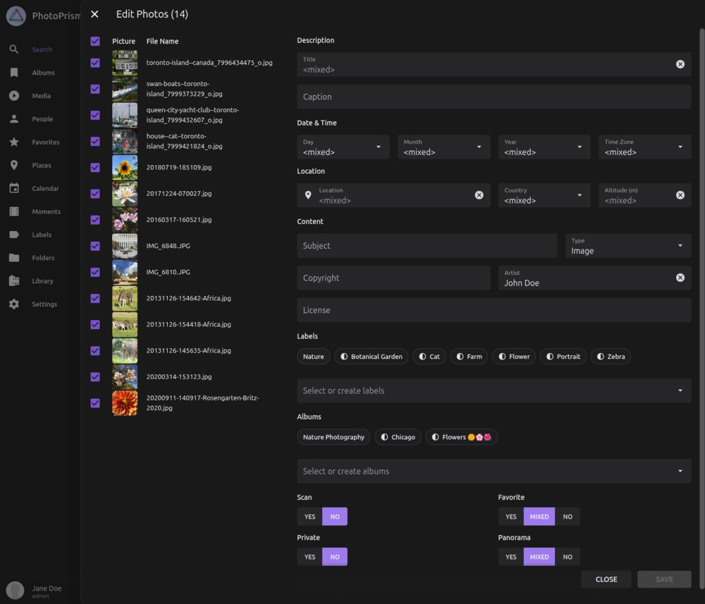
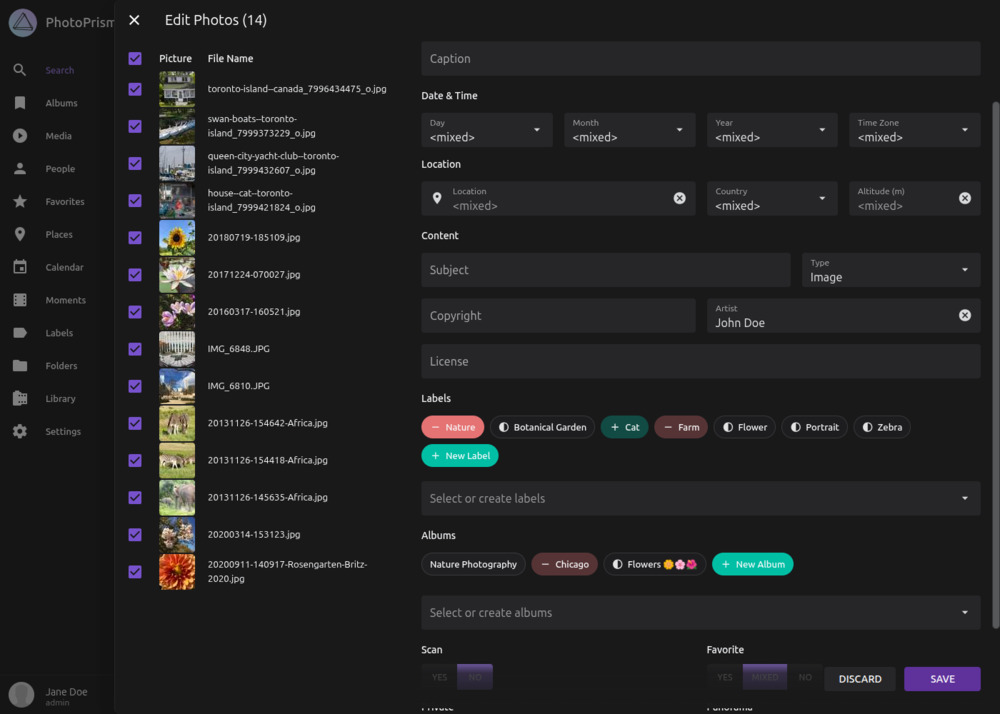

# Batch Edit

With batch editing, you can change the metadata, albums, and labels of many pictures at once. If this feature is enabled, you can select up to **999** pictures and apply the same changes to either the entire selection or a subset of it.

## Opening the Dialog

To open the **Batch Edit** dialog:

1. Select multiple pictures.
2. Open the context menu.
3. Click the pencil :material-pencil: icon.

The form fields in the dialog show the current values only if they are the same for the entire selection. If the values differ, you will see `<mixed>`. Entering a new value replaces the existing values on **all** pictures you apply the change to.

{ class="shadow" }

!!! note ""
    You can deselect pictures in the dialog to exclude them from the changes. The values shown in the fields still reflect the **original selection**, even if you deselect some pictures.

## Labels and Albums  

[{ class="shadow right" }](img/batch-edit-3-1125.jpg)
Entries that are assigned to **all** selected pictures are listed first. Each entry is shown as a small chip. If a [label](labels.md) or [album](albums.md) is assigned to only some of the selected pictures, its chip is shown as *partially assigned*.

- Click a partially assigned label or album chip **once** to assign it to **all** selected pictures.
- Click the same chip **again** to remove that label or album from **all** selected pictures.

You can assign additional labels or albums using the input field:

- Start typing to search existing labels and albums.
- If the name does not exist yet, a new label or album will be created automatically.
