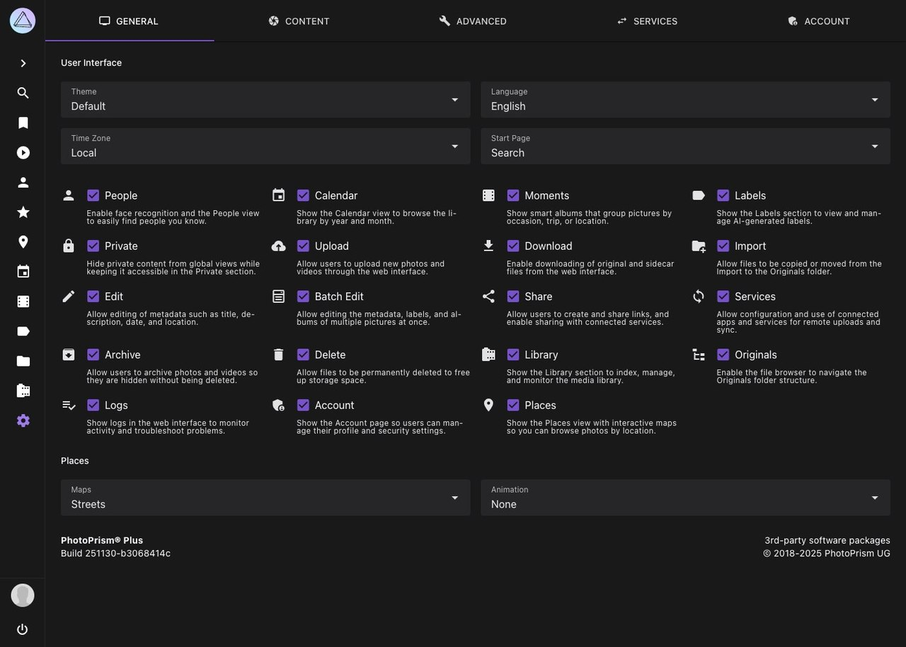

# General Settings

In the *General* settings tab, you can configure basic user interface settings as well as the maps in *Places*:

{ class="shadow" }

!!! info ""
    Feature switches in this tab are primarily intended for instance-wide customization. Some options are only shown to super admins and are not available in every edition or session type.

## User Interface ##
You can change the *theme* and *language* of the user interface and define a *start page* and *time zone*.

To make PhotoPrism suit your individual needs, the following sections and features can be enabled or disabled.
Disabled sections do not appear in the main navigation.

#### :material-account: People ####
When disabled, the people section is hidden. To disable face detection while indexing, you may set `PHOTOPRISM_DISABLE_FACES` and/or `PHOTOPRISM_DISABLE_TENSORFLOW` to `"true"` in your [config](../../getting-started/config-options.md).

#### :material-calendar: Calendar ####
When disabled, there is no *Calendar* section.

#### :material-filmstrip-box: Moments ####
When disabled, there is no *Moments* section.

#### :material-label: Labels ####
When disabled, there is no *Labels* section and you cannot add or edit labels.

#### :material-lock: Private ####
Hides content marked as private from global views while keeping it accessible in the *Private* section.

#### :material-cloud-upload: Upload ####
When disabled, uploading files via [Web Upload](../library/upload.md) is not possible.
This can be useful when you grant others access to your instance but do not want them to upload files.

#### :material-download: Download ####
When disabled, no files can be downloaded from the PhotoPrism web interface. Please note that browser features such as saving already displayed content may still work.

#### :material-folder-plus: Import ####
When disabled, files can no longer be [imported](../library/import.md) from the import folder. You must use [indexing](../library/originals.md) instead to discover newly added originals.

#### :material-pencil: Edit ####
When disabled, it is not possible to edit photo details.

#### :material-form-select: Batch Edit ####
When disabled, it is not possible to batch edit photo details.

#### :material-share-variant: Share ####
When disabled, users cannot create share links or share content with connected services.

#### :material-sync: Services ####
Allows configuration and use of connected [apps and services](sync.md) for remote uploads and synchronization.

#### :material-package-down: Archive ####
When disabled, there is no *Archive* section. Pictures that were archived before will appear in search results again.

#### :material-delete: Delete ####
When disabled, files can no longer be permanently deleted from the archive.

#### :material-film: Library ####
When disabled, there is no *Library* section for indexing and maintenance tasks.

#### :material-file-tree: Originals ####
When disabled, there is no *Originals* file-browser section.

#### :material-playlist-check: Logs ####
When disabled, logs are not shown in the web interface.

#### :material-shield-account-variant: Account ####
When disabled, there is no *Account* section.

#### :material-map-marker: Places ####
When disabled, there is no *Places* section.

## Places ##

At the bottom of the *General* settings tab, you can choose your preferred map style and animation length for *Places*.
PhotoPrism includes multiple high-resolution world maps so you can browse your library by location.

To enhance your photos with location data such as country, state, city, and category, PhotoPrism also includes reverse geocoding based on OpenStreetMap data.
